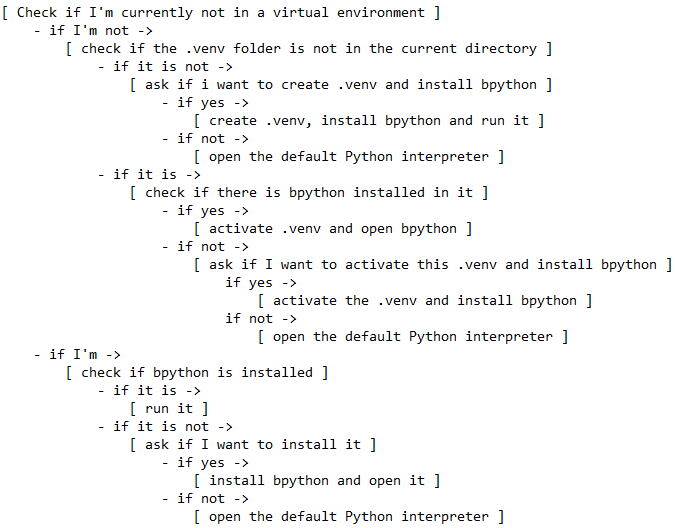

## How to make it work
1) Clone this repo in any folder
2) Move the '.bpython_runner.sh' file to the home directory
3) Create an alias in '~/.bashrc' file, for example -> alias "YOU ALIAS HERE"="source $HOME/.bpython_runner.sh"
4) Restart your current session
5) Type the alias that you created earlier in any folder

## The workflow of the script

## Notes
1) I use this script by myself and I like to name my 'venv' folders as '.venv', so this
script won't work if you name your 'venv' folders differently
2) I'm using WSL Ubuntu 22.04.3 LTS
